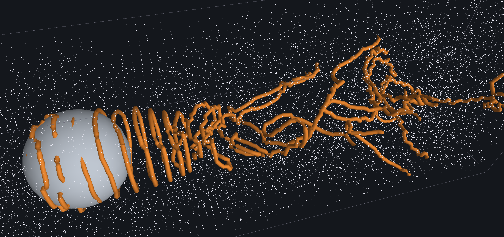

# bochner

Numerical study and interactive tool for **connection Laplacians** arising in vortex-filament extraction from fluid simulations.

An interactive 3D fluid simulator (Covector Fluids on a regular MAC grid) with vortex structure extracted live as discrete vortex filaments (Weissmann–Pinkall). The research core is the **smallest-eigenvector solve** of the connection Laplacian in the extraction step, and the contribution is a **gauge-aware multigrid eigensolver** — **covMG-LOBPCG** — for that mode that is mesh-independent and beats the Lanczos baseline by **~3–13× over 27k–524k DOFs in a fair single-threaded comparison** (8.0×/12.8× at 221k/524k vs SLEPc defaults, 5.5×/8.9× against the `ncv`-tuned baseline; additionally our solver parallelizes with OpenMP, which the one-MPI-rank SLEPc baseline cannot).

**Pass/fail criterion:** interactivity — combined sim + extraction at ≥10 fps on a 100k–500k-cell grid. **Partially met:** reached at ~97k cells (46³, extraction every 3rd frame) — just *below* the stated interval — and the GPU obstacle demo runs its full loop at ~47 fps at 58k cells; the CPU path at 262k cells is ~5 fps, so the upper half of the range is not met. See Status.

<p align="center">
  
</p>

<p align="center">
  <em>Flow past a sphere in <code>bochner_obstacle_viewer</code>: the connection-Laplacian eigensolver traces the shed von Kármán wake as vortex filaments (orange) live, over a white smoke-tracer field — the extraction running on a physically generated wake, end to end.</em>
</p>

**Physical validation.** Beyond timings, the obstacle demo reproduces the textbook **sphere-wake regime sequence**: a steady axisymmetric recirculating torus at low Reynolds number, loss of axisymmetry as it rises, then periodic shedding of loop vortices — less regular than a cylinder's von Kármán street, which is how spheres actually shed. Sweeping viscosity at fixed inflow brackets the onset of unsteadiness at **250 < Re < 318** against a literature value of **Re ≈ 270**, on a body only ~11 cells across. Details and caveats in [`docs/simulation-algorithm.md`](docs/simulation-algorithm.md) §2.3.

## Documentation

- [`docs/simulation-algorithm.md`](docs/simulation-algorithm.md) — the full per-frame pipeline (Covector Fluids step + Weissmann–Pinkall extraction).
- [`docs/gauge-multigrid.md`](docs/gauge-multigrid.md) — the gauge-aware multigrid method (prolongation, V-cycle, Rayleigh-quotient eigensolver).
- [`docs/gauge-solver-comparison.md`](docs/gauge-solver-comparison.md) — head-to-head of this multigrid against a [companion 18-solver study](https://coding.wirbellinie.de/when-preconditioners-make-things-worse-solving-the-u1-connection-laplacian/) by the same author (write-up only; its harness is not public) on the periodic 3-torus connection Laplacian: fastest linear solve with zero setup, and 2.3–12.4× over SLEPc Lanczos for the eigenpair.

## Status

**The pipeline is complete and runs interactively.** End-to-end on a 3D regular MAC grid (dual/flux placement): BFECC covector advection → geometric-MG pressure projection → connection Laplacian on the dual cell graph → smallest-eigenvector extraction → zero-set trace/link into filament curves. The OpenGL viewer runs the sim live and re-extracts the filament, with a live FPS readout.

**The eigensolver works.** The per-frame smallest-eigenvector solve was *the* bottleneck — ~2 s/frame with Lanczos at 97k cells. The earlier search (Lanczos, inverse iteration, even-odd, shift-invert, LOBPCG, Davidson) found the hardness is the eigen-*gap*, not conditioning, so no linear-solve preconditioner helped. The answer was a **gauge-aware multigrid**: a parallel-transport prolongation (covariant subdivision) makes multigrid work on the connection Laplacian, where scalar AMG fails. Built as a mesh-independent linear V-cycle and a Rayleigh-quotient (LOBPCG) eigensolver on top — **covMG-LOBPCG** — then optimized (red-black Gauss–Seidel, precomputed transports, OpenMP). Result vs SLEPc Lanczos, single-threaded (the fair comparison — SLEPc is one MPI rank with no OpenMP), certified 2026-07-17 medians (the paper's ring table, Table 1): **3.1× at 27k, 4.0× at 65k, 8.0× at 221k, 12.8× at 524k real DOFs** against SLEPc defaults (**5.5×/8.9×** at 221k/524k against the swept `ncv=32`-tuned baseline), eigenvalues matching to 5 digits. In the interactive pipeline the wall-clock gap is wider still, because our solver additionally threads (OpenMP) while the one-rank SLEPc baseline cannot.

**Cross-validated against a separate solver suite.** The connection Laplacian is a U(1) lattice gauge theory, and its linear-solver comparison is a [companion study](https://coding.wirbellinie.de/when-preconditioners-make-things-worse-solving-the-u1-connection-laplacian/) by the same author (18 methods; headline: classical AMG pays a 3× gauge penalty). **That harness is not public**, so the §1 linear-solve numbers below cannot be re-run from this repository — the eigensolver comparisons, which are the paper's headline, use tools committed here (`eig_compare`, `torus_eig_compare`). Running this project's geometric gauge-MG inside that harness on the same periodic 3-torus operator (verified identical to ~1e-16), it holds a **flat 5–7 cycle V-cycle count across n=8→64, with zero setup** — the fastest solve on the table, and its wall-time series extends to 4.2M DOFs (n=128), and its lead widens with resolution: ~61× faster than adaptive-GAMG's solve+setup at n=128 (966 ms vs ≈58.7 s). Its Rayleigh-quotient eigensolver (covMG-LOBPCG) beats SLEPc Lanczos (single-threaded, the fair setup — SLEPc has no OpenMP) by **2.3–12.4×, growing with resolution** (2.5× at 8k DOFs → 12.4× at 1.77M; 10.3× there against the `ncv`-tuned baseline; 2026-07-17 vintage), eigenvalues agreeing to ~1e-12 and eigenvectors to the same complex line. See [`docs/gauge-solver-comparison.md`](docs/gauge-solver-comparison.md).

**Interactivity.** With the geometric-MG pressure solve (warm-started) and extraction decoupled to every few frames, the full sim + extraction reaches **≥10 fps at ~97k cells** (46³, 4 threads) at an every-3rd-frame extraction cadence (every 2nd: ~9 fps; re-measured 2026-07-17 — warm eigensolve ~88 ms/frame, sim floor 59 ms; an earlier ~75 ms-eigensolve / 10.5–12 fps measurement is not reproduced today) — meeting the criterion at the low end of the target range. Thread scaling is grid-size-dependent: at 110k cells the sim is bandwidth-bound so 4 threads suffices, but at 262k cells it stays compute-bound and the sim floor runs ~8 fps at 4 threads, reaching ~10 fps only on all 11 cores — the full pipeline there is still ~5 fps, so closing the upper half of the 100k–500k range is the remaining work (advection is a GPU candidate, as in Covector Fluids).

## Building

> **PETSc/SLEPc is optional.** The whole live pipeline — advection, projection, gauge-MG eigensolve, extraction — and both interactive viewers build and run without it:
>
> ```sh
> cmake -S . -B build -DCMAKE_BUILD_TYPE=Release -DBOCHNER_WITH_VIEWER=ON
> cmake --build build
> ```
>
> PETSc + SLEPc are needed only for the *comparison baselines* (SLEPc Lanczos), the legacy stateless projection, and 13 gated test suites — add `-DBOCHNER_WITH_PETSC=ON` for those. `scripts/build_petsc_slepc.sh` builds them, pinned to **PETSc 3.25.2 / SLEPc 3.25.1**, the versions every published baseline timing was measured against (override with `PETSC_TAG`/`SLEPC_TAG`).

```sh
cmake -S . -B build -DCMAKE_BUILD_TYPE=Release -DBOCHNER_WITH_PETSC=ON
cmake --build build
ctest --test-dir build --output-on-failure
```

OpenMP is enabled by default (`BOCHNER_WITH_OPENMP`, with a Homebrew-`libomp` fallback on AppleClang); the gauge/Poisson multigrids and the advection run multi-threaded. API docs (requires Doxygen): `cmake --build build --target docs`.

An opt-in **Metal GPU compute backend** (`-DBOCHNER_WITH_METAL=ON`, Apple only) offloads the whole per-frame pipeline — advection (device-resident BFECC), the pressure projection (MGPCG), and the filament-extraction eigensolve (the gauge-multigrid covMG-LOBPCG) — onto the GPU; shaders are compiled from source at runtime, so it needs only the Command Line Tools (no Xcode `metal` toolchain). It is single-precision (Metal has no `double`), an opt-in overlay verified against the authoritative CPU/double path to float tolerance kernel-by-kernel in `tests/test_metal_sample`. Measured with the committed profiler `tools/obstacle_profile` (58k-cell obstacle demo, median per frame): device-resident BFECC advection is ~14× the 4-thread CPU path (19.7→1.4 ms), the MGPCG projection ~7.2× (41.5→5.8 ms), and the extraction eigensolve (fully device-resident) ~8–15× per frame (warm-started) at 24k–200k cells, tracing the same shed vortices (see `docs/gauge-multigrid.md` §5a). Code in `src/gpu/`.

### Interactive viewer

An opt-in OpenGL viewer (GLFW + Dear ImGui, fetched via CMake `FetchContent`) runs the live pipeline and renders the extracted filament, the domain box, and velocity glyphs, with a HUD (sim ms / extract ms / amortized fps) and ImGui controls for the seed (vortex ring, Hill's vortex, leapfrog rings, trefoil knot, Hopf link, head-on collision — defaults to the trefoil, with the CF+MCM long-time flow map on), `R`/`Γ`/`core`/`a`, `dt`, the flux quantum `ħ`, grid `n`, and the extraction cadence (every `N` frames):

```sh
cmake -S . -B build -DBOCHNER_WITH_PETSC=ON -DBOCHNER_WITH_VIEWER=ON
cmake --build build --target bochner_viewer
OMP_NUM_THREADS=4 ./build/tools/viewer/bochner_viewer
```

Press **Play**; drag to orbit, scroll to zoom. Slide **grid n** and **extract every N frames** to watch the cost/quality trade-off live.

### Flow-past-obstacle viewer

A second app, `bochner_obstacle_viewer`, drives a flow tank: constant `+x` inflow past a solid obstacle (cylinder, sphere, or a finite oriented box / inclined plate), with a viscosity (Reynolds) control that turns the free-slip potential flow into a vorticity-shedding von Kármán wake. It runs the same connection-Laplacian extraction live on that physically-generated wake (the shed vortices as filament tubes), plus a white-smoke tracer field for a solver-free wake view.

```sh
cmake -S . -B build -DBOCHNER_WITH_PETSC=ON -DBOCHNER_WITH_VIEWER=ON
cmake --build build --target bochner_obstacle_viewer
./build/tools/viewer/bochner_obstacle_viewer
```

Pick a **shape** (the box/plate expose width, thickness, span, yaw, and tilt), raise **inflow U** or lower **viscosity ν** to increase the Reynolds number, and **Play** to watch the wake shed and the filaments trace it.

## Layout

```
docs/                     algorithm write-ups (+ Doxygen output)
scripts/                  build helpers (PETSc/SLEPc from source)
third_party/              vendored deps (doctest)
src/grid/                 foundation: MAC grid, stencils, solid masks, sparse matrix
src/solvers/              linear systems + eigensolvers (the gauge-multigrid core)
src/fluid/                Covector Fluids simulation
src/extraction/           Weissmann-Pinkall vortex-filament extraction
tests/                    doctest suites (ctest)
tools/                    benchmarks, demos, the interactive viewers (+ viewer_support)
```

Each `src/` module is its own library (`bochner_grid`, `_solvers`, `_fluid`, `_extraction`) with explicit link dependencies, so the layering is enforced by the build; `bochner_core` aggregates them for consumers.

## Built on

The two papers this project implements:

- **Covector Fluids** — Nabizadeh, Wang, Ramamoorthi, Chern, *ACM TOG* 41(4), 2022. The advection scheme: transport the velocity *covector* through the flow map, which is what makes the simulation non-dissipative enough for filaments to survive.
- **Smoke Rings from Smoke** — Weissmann & Pinkall, *ACM TOG* 33(4), 2014. The extraction: vortex filaments are the zero set of a complex wavefunction, traced by phase winding around lattice plaquettes.

The companion article carries the full bibliography.

## Citing

The companion article is:

> Felix Knöppel, *Fast Ground States of the Connection Laplacian: A Gauge-Covariant Geometric Multigrid with Closed-Form Transfers*, 2026.

Machine-readable metadata is in [`CITATION.cff`](CITATION.cff). References to "the paper", "the article", and "the paper's ring table" throughout this README and `docs/` mean this article; its ring table is Table 1.

## License

See [`LICENSE`](LICENSE): free for personal, academic, and research use, with no warranty and no commercial use. **This is not an OSI-approved open source license** — it restricts commercial use, so please read it before forking or redistributing.

